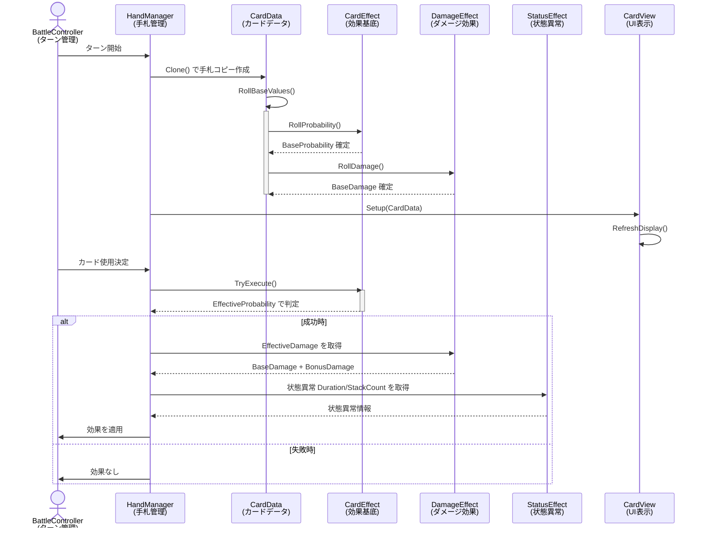

# Card System（カードシステム）

## システム概要

カードシステムは **1ターン1枚** のカード使用を管理します。
Player/Monster が手札から選択したカードの効果を確定・実行し、その結果をゲーム状態に反映させます。

---

## 全体フロー



---

## データ構造

### CardData（カード1枚の定義）

```csharp
[CreateAssetMenu(fileName = "CardData", menuName = "ODDESEY/CardData")]
public class CardData : ScriptableObject
{
    public string CardName;
    public Sprite CardSprite;
    public List<CardEffectBase> Effects;        // 複数の効果を持つ可能
    public float LuckConversionRate = 20f;      // 砕くときの運ゲージ還元率
    public bool IsRolled { get; }               // ロール済みフラグ
}
```

**重要な点:**
- **ScriptableObject は共有されるため、`Clone()` で独立したインスタンスを生成する必要がある**
- 効果は複数持つことができ、種類を問わない（ダメージ + 状態異常 など）

---

## 確率計算システム

### 確率フロー

```
┌─────────────────────────────────────────────────┐
│ 手札に追加される時点（RollBaseValues()）         │
└─────────────────────────────────────────────────┘
                      ↓
  ProbabilityMin  ProbabilityMax
        ↓                 ↓
        └─Random.Range()─┘  ← isHotMode=false
                      OR
              ProbabilityMax  ← isHotMode=true
                      ↓
             BaseProbability    [確定]
                      ↓
┌─────────────────────────────────────────────────┐
│ カード実行時（TryExecute()）                    │
└─────────────────────────────────────────────────┘
                      ↓
         BaseProbability + BonusProbability
             (運ゲージで上乗せ)
                      ↓
           EffectiveProbability (上限 1.0)
                      ↓
         Random.value <= EffectiveProbability?
            ↓Yes          ↓No
           成功           失敗
```

### CardEffectBase（すべての効果の基底）

```csharp
public abstract class CardEffectBase : ScriptableObject
{
    // ===== Inspector で設定するもの =====
    [Range(0f, 1f)] public float ProbabilityMin = 1f;  // 抽選の最小値
    [Range(0f, 1f)] public float ProbabilityMax = 1f;  // 抽選の最大値
    
    // ===== 実行時に初期化 =====
    public float BaseProbability { get; }              // 手札時点で確定
    public float BonusProbability { get; set; }        // 運ゲージで上乗せ
    
    // ===== 実効値 =====
    public float EffectiveProbability =>
        Mathf.Min(BaseProbability + BonusProbability, 1f);
    
    // ===== 実行メソッド =====
    public void RollProbability(bool isHotMode)
        => BaseProbability = isHotMode ? ProbabilityMax 
                                       : Random.Range(ProbabilityMin, ProbabilityMax);
    
    public bool TryExecute()
        => Random.value <= EffectiveProbability;
}
```

**状態遷移:**
| 状態 | 値 | 説明 |
|------|-----|------|
| **未使用** | なし | Inspectorで設定待ち |
| **確定済み** | `BaseProbability` | 手札追加時にロール済み |
| **実行時** | `EffectiveProbability` | 運ゲージボーナスを加算した確率で判定 |

---

## 効果実装

### DamageEffect（ダメージ効果）

```csharp
[CreateAssetMenu(menuName = "CardEffect/Damage")]
public class DamageEffect : CardEffectBase
{
    // ===== Inspector で設定するもの =====
    public int DamageMin = 3;
    public int DamageMax = 6;
    
    // ===== 実行時に初期化 =====
    public int BaseDamage { get; }                    // 手札時点で確定
    public int BonusDamage { get; set; }              // 運ゲージで上乗せ
    
    // ===== 実効値 =====
    public int EffectiveDamage => BaseDamage + BonusDamage;
    
    // ===== ロール =====
    public void RollDamage(bool isHotMode)
        => BaseDamage = isHotMode ? DamageMax 
                                  : Random.Range(DamageMin, DamageMax + 1);
}
```

**確率とは別に、ダメージにもホットモード対応:**
- `isHotMode=false`: Min ～ Max の間でランダム
- `isHotMode=true`: Max 固定（確定)

---

### StatusEffect（状態異常効果）

```csharp
public enum StatusType
{
    Shock,      // 感電
    Burn,       // 燃焼
    Poison,     // 毒
}

[CreateAssetMenu(menuName = "CardEffect/Status")]
public class StatusEffect : CardEffectBase
{
    public StatusType StatusType;
    public int Duration = 2;                // 持続ターン数
    public int StackCount = 1;              // スタック数（重ね掛け対応）
}
```

**特徴:**
- 確率は固定値（`ProbabilityMin = ProbabilityMax = 1f`）が多い
- 複数の状態異常を同時に持つことは想定していない（1エフェクト = 1状態異常）

---

## CardView（UI管理）

```csharp
public class CardView : MonoBehaviour,
    IBeginDragHandler, IDragHandler, IEndDragHandler, IPointerClickHandler
{
    // ===== セットアップ =====
    public void Setup(CardData cardData, Action<CardView> onDroppedToSlot = null)
    {
        this.cardData = cardData;
        _onDroppedToSlot = onDroppedToSlot;
        RefreshDisplay();
    }
    
    // ===== 状態管理 =====
    public void SetState(CardState state)
    {
        this.state = state;
        RefreshDisplay();
    }
    
    // ===== 演出 =====
    public async UniTask PlayDealAnimationAsync()     // ドロー演出
    public async UniTask PlayBreakAnimationAsync()    // 砕く演出
    
    // ===== 入力 =====
    // IBeginDragHandler, IDragHandler, IEndDragHandler で ドラッグ対応
    // IPointerClickHandler で クリック対応
}
```

**CardState（カードの表示状態）**
- `None`: 未使用
- `Normal`: 通常状態
- `Use`: 使用可能
- `Break`: 砕かれた

---

## ライフサイクル

### 1. 手札作成～ロール

```csharp
// BattleController / HandManager から呼び出し
CardData original = Assets.CardDatabase[cardId];
CardInstance instance = new CardInstance(original);     // ① CardInstance 生成（参照のみ）
instance.RollValues(isHotMode);                         // ② 効果値をロール
                                                        // ③ _rolledProbabilities, _rolledDamages 確定
```

### 2. UI表示

```csharp
cardView.Setup(instance.OriginalData);         // CardData を受け取る（UI表示用）
cardView.SetState(CardState.Use);              // UI表示可能に
await cardView.PlayDealAnimationAsync();       // ドロー演出
```

### 3. カード実行

```csharp
for (int i = 0; i < instance.OriginalData.Effects.Count; i++)
{
    if (instance.TryExecuteEffect(i))          // ④ 確率判定（EffectiveProbability）
    {
        var effect = instance.OriginalData.Effects[i];
        
        if (effect is DamageEffect dmg)
        {
            int damage = instance.GetEffectiveDamage(i);  // ダメージ確定
            target.TakeDamage(damage);
        }
        else if (effect is StatusEffect status)
        {
            target.ApplyStatus(status.StatusType, status.Duration);
        }
    }
}
```

### 4. カード破棄

```csharp
cardView.SetState(CardState.Break);
await cardView.PlayBreakAnimationAsync();     // 砕く演出
// CardInstance 自体はGC対象（参照が消滅）
float recoveredLuck = instance.OriginalData.LuckConversionRate;
luckSystem.Add(recoveredLuck);
```

---

## 運ゲージとの連携

### 確率・ダメージの強化

```csharp
// 運ゲージを消費して効果を強化
public class LuckSystem
{
    public void EnhanceEffect(CardInstance cardInstance, int effectIndex, int luckCost)
    {
        float bonus = luckCost / 100f;
        cardInstance.AddBonusProbability(effectIndex, bonus);  // 加算（上限1.0）
        
        var effect = cardInstance.OriginalData.Effects[effectIndex];
        if (effect is DamageEffect dmg)
            cardInstance.AddBonusDamage(effectIndex, luckCost / 2);  // 直上乗せ
    }
}
```

### 砕く

```csharp
// カード砕く時の運ゲージ還元
float recoveredLuck = card.LuckConversionRate;
luckSystem.Add(recoveredLuck);
```

---

## 実装上の注意

| 項目 | 内容 |
|------|------|
| **Clone() 必須** | ScriptableObject は参照型なので、手札ごとに独立した値を持たせる |
| **RollBaseValues() の呼び出し** | 手札追加時に **1度だけ** 呼ぶ（ロール後は BaseProbability, BaseDamage は不変） |
| **isHotMode** | CardData.RollBaseValues() にのみ渡す（ホット時は全値が最大に） |
| **EffectiveProbability上限** | `Mathf.Min(BaseProbability + BonusProbability, 1f)` で 1.0 を超えない |
| **EffectiveDamage上限** | **上限なし**（運ゲージでいくらでも増える） |
| **複数効果** | カード1枚に効果複数付与可能、すべて独立して判定 |
